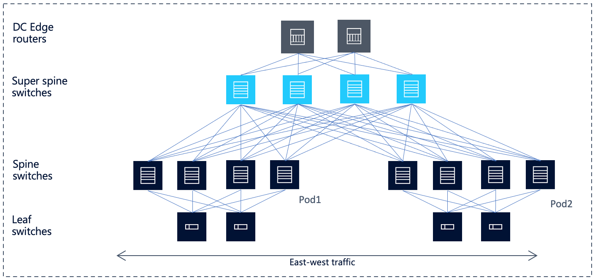
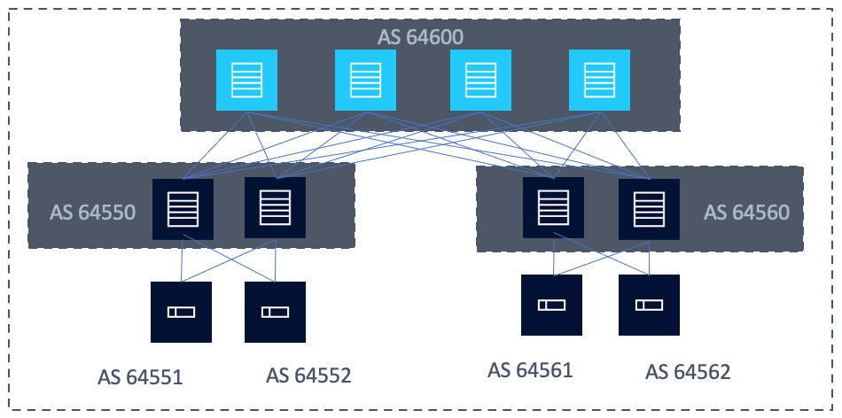

# Fabric Routing

## BGP Design

### eBGP Considerations

For the remainder of the data center BGP implementation discussion, we will use a common 5-stage / 3-tier Clos architecture as our reference design (**Figure 3-2**).
This design is quite popular among large network operators across industries.
The data center edge routers in this design are meant for north/south traffic that needs to exit the data center.
East-West traffic between nodes in the same data center flows across the spine and/or superspine layer.

<figure>
  
  <figcaption>Figure 3-2</figcaption>
</figure>

### Autonomous System Selection

There is some flexibility in determining the autonomous system numbering scheme and assignment, but the network designer will need to work within the constraints of eBGP and follow some best practices for optimal path selection.
All best-path-selection criteria being equal, AS path will be the tie breaker for determining the route to be installed into the forwarding table.
It is also necessary to consider scale when determining whether to choose 2-byte or 4-byte AS numbering.

### 2-byte or 4-byte Private AS?

When determining ASN assignment, the best practice is to utilize private ASNs (2- or 4-byte) to avoid the chance of leaking a public (usually 2-byte) ASN to an external network which could potentially cause havoc to internet peers.
2-byte private ASNs provide a total 1023 unique numbers in the range of 64512-65534.
For smaller Data Centers, this number may enough and there are mechanisms that facilitate the reuse of ASNs within a DC if this number falls short.
For larger data centers and those considering extending BGP to the host (a topic that will be discussed later), 4-byte ASNs may prove more appropriate.
4-byte private ASNs provide a total of 95 million unique numbers in the range of 4200000000–4294967294.
Nearly every vendor supports 4-byte ASNs, with only possible downside being the supported notation for vendor interop.
SR Linux devices support `ASplain` notation only.

Once the decision regarding 2-byte vs 4-byte ASNs has been made, assignment of these numbers to each router within the Clos fabric must be considered.
Logically, it would make sense to assign a unique AS to each and every node within the fabric, but there are downsides to this decision due to the nature of path vector protocols like BGP. 

### AS Path Hunting, Multipathing and AS Assignment

One of the differences between BGP and a link state protocol like OSPF or IS-IS is the lack of awareness of the overall network topology.
An eBGP speaker only knows about its directly connected neighbors.
If each router in the fabric is assigned a unique AS, "path hunting" becomes a potential issue that can lead to a "hunt-to-infinity" scenario.
AS path hunting behavior means that when a route is withdrawn, BGP does not know if the route has truly disappeared or if there is another possible path.
BGP will keep "hunting" all other possible paths until the prefix disappears from all routing tables.
This scenario can lead to long convergence times and is not desirable for a data center fabric.

An alternative approach to assigning each node its own AS is to use the following scheme (see **Figure 3-3**):

* Assign a unique AS per Leaf (ToR)
* Assign a common AS per Spine per pod
* Assign a common AS for the Super Spine 

<figure>
  
  <figcaption>Figure 3-3</figcaption>
</figure>

In this example we follow the above recommended AS assignments to minimize path hunting and allow for better multipathing.
Let’s walk through a quick example:

In **Figure 3-3**, the ToR with AS 64562 will advertise its locally learned routes.
Spines in AS 64560 will advertise that route via the super spine in AS64600, down to the spines in AS64550, and finally to their Directly connected ToRs.  

When ToR with AS64551 receives the route, it will see the following AS path from both spine routers: (64562, 64560, 64600, 64550).

The ToR will see the same `AS_PATH` from each spine router (each with a different next-hop) and will install both routes in its FIB.
ECMP will see two routes and make use of both.
If the `AS_PATH` was different, BGP would go further down the list of the best path selection algorithm and only install one route.

